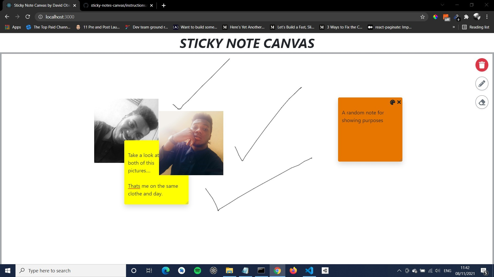

### STICKY NOTE CANVAS

### DEMO PIC

**Check instructions.md file for app specifications**

### How to run this app

_run the following commands in root directory_

- yarn install or npm install.
- yarn start or npm start.
- A localhost URL would be shown to you, that's where the app would be live. The default URL = http://localhost:3000
- Enjoy.
